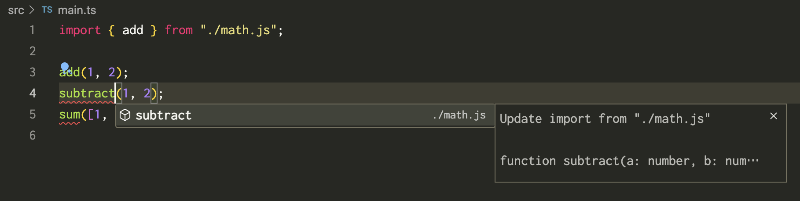
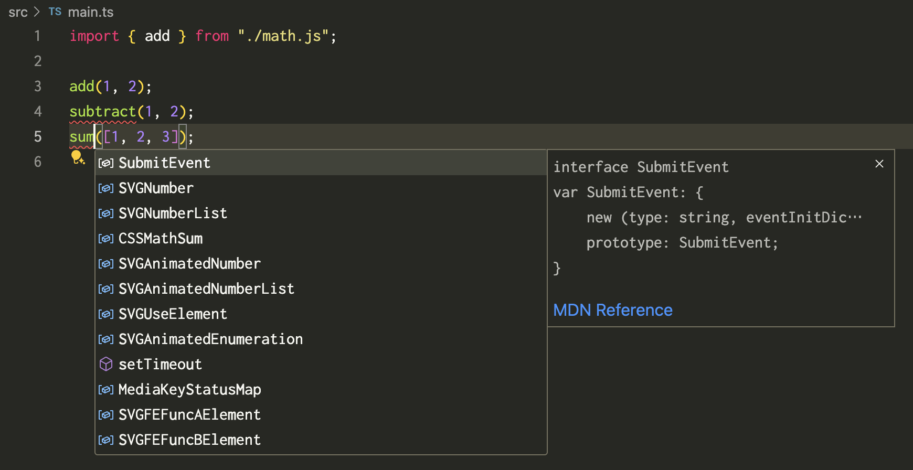
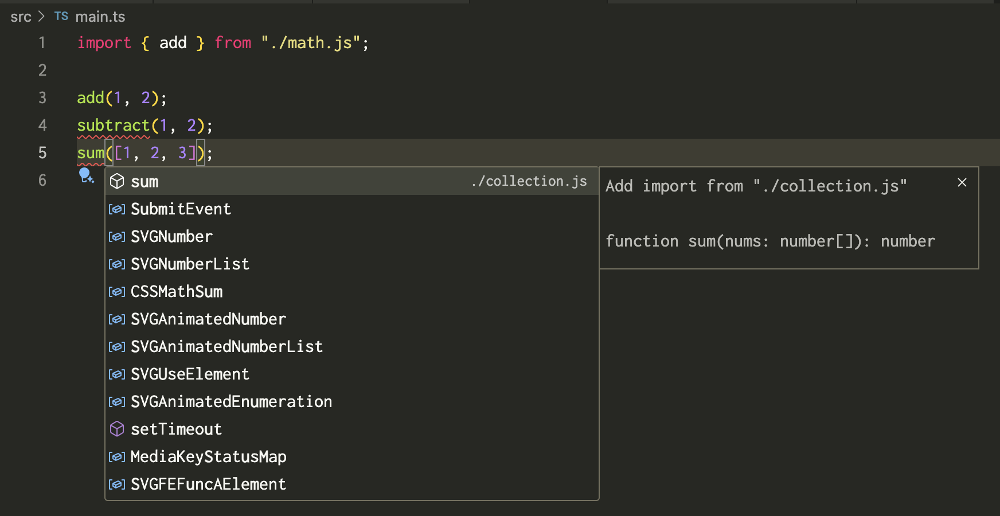

# tsconfig-includes-test

## Environment

- Node.js: 22.0.0
- typescript: 5.5.4

## Test results

### `"includes": ["src/main.ts"]`

`tsc` includes only `src/main.ts` and `src/math.ts`, but does not include `src/collection.ts` and `src/log.ts`.

```console
$ npx tsc --listFilesOnly | grep -v node_modules
/Users/mizdra/src/github.com/mizdra/tsconfig-includes-test/src/math.ts
/Users/mizdra/src/github.com/mizdra/tsconfig-includes-test/src/main.ts
```

`substract` is auto-importable from editor, but `sum` is not auto-importable.





### `"includes": ["src/*"]`

`tsc` type-checks all source files in `src` directory.

```console
$ npx tsc --listFilesOnly | grep -v node_modules
/Users/mizdra/src/github.com/mizdra/tsconfig-includes-test/src/collection.ts
/Users/mizdra/src/github.com/mizdra/tsconfig-includes-test/src/log.ts
/Users/mizdra/src/github.com/mizdra/tsconfig-includes-test/src/math.ts
/Users/mizdra/src/github.com/mizdra/tsconfig-includes-test/src/main.ts
```

`substract` and `sum` is auto-importable from editor.




### `"includes": ["src/**/*"]`

`tsc` type-checks all source files in `src` directory.

```console
$ npx tsc --listFilesOnly | grep -v node_modules
/Users/mizdra/src/github.com/mizdra/tsconfig-includes-test/src/collection.ts
/Users/mizdra/src/github.com/mizdra/tsconfig-includes-test/src/log.ts
/Users/mizdra/src/github.com/mizdra/tsconfig-includes-test/src/math.ts
/Users/mizdra/src/github.com/mizdra/tsconfig-includes-test/src/main.ts
```

`substract` and `sum` is auto-importable from editor.


### `"includes": ["src/**"]`

`tsc` throws an error.

```console
$ npx tsc --listFilesOnly | grep -v node_modules
error TS18003: No inputs were found in config file '/Users/mizdra/src/github.com/mizdra/tsconfig-includes-test/tsconfig.json'. Specified 'include' paths were '["src/**"]' and 'exclude' paths were '[]'.
tsconfig.json(2,15): error TS5010: File specification cannot end in a recursive directory wildcard ('**'): 'src/**'.
```

### `"includes": ["src"]`

`tsc` type-checks all source files in `src` directory.

```console
$ npx tsc --listFilesOnly | grep -v node_modules
/Users/mizdra/src/github.com/mizdra/tsconfig-includes-test/src/collection.ts
/Users/mizdra/src/github.com/mizdra/tsconfig-includes-test/src/log.ts
/Users/mizdra/src/github.com/mizdra/tsconfig-includes-test/src/math.ts
/Users/mizdra/src/github.com/mizdra/tsconfig-includes-test/src/main.ts
```

`substract` and `sum` is auto-importable from editor.


### `includes` option is not set

`tsc` type-checks all source files in `src` directory.

```console
$ npx tsc --listFilesOnly | grep -v node_modules
/Users/mizdra/src/github.com/mizdra/tsconfig-includes-test/src/collection.ts
/Users/mizdra/src/github.com/mizdra/tsconfig-includes-test/src/log.ts
/Users/mizdra/src/github.com/mizdra/tsconfig-includes-test/src/math.ts
/Users/mizdra/src/github.com/mizdra/tsconfig-includes-test/src/main.ts
```

`substract` and `sum` is auto-importable from editor.


